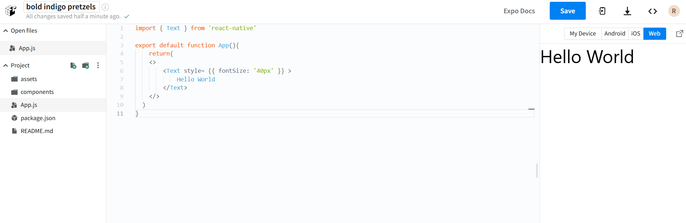

# 2 1st App

```javascript
import { Text } from 'react-native'

export default function App(){
    return(
    <>
        <Text style= {{ fontSize: '40px' }} >
            Hello World
        </Text>
    </>
  )
}
```

### Website to Quickly Test:

#### [https://snack.expo.dev/](https://snack.expo.dev/)


<figure><figcaption></figcaption></figure>

