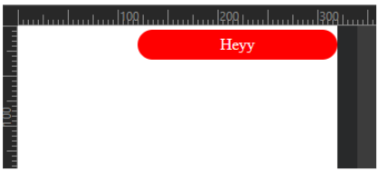

# 3 React Native Core Components

### 1. Text

```
<Text>
</Text>
```

import { Text } from 'react-native'

Example:

```javascript
import { Text } from 'react-native'

<Text style= {{ fontSize: '40px' }} >
Hello World
</Text>
```

### 1.5 SafeAreaView

makes sure your app content shows in between the safe area

```javascript
import { SafeAreaView } from "react-native";

<SafeAreaView style={{ flex: 1, backgroundColor: "white" }}>
   {/* Rest of the Code */}
</SafeAreaView>
```

<figure><figcaption></figcaption></figure>

### 2. View

a.k.a  div in react

```
<View>
</View>
```

import {view} from 'react-native'

### 3. TextInput

useful for making SearchBox

```
<TextInput>
</TextInput>
```

import { TextInput } from 'react-native'

Example:

```javascript
import { TextInput } from "react-native";

<TextInput 
    style={styles.input}
    placeholder="Enter Something" 
    autoCorrect={true}
/>
```

### 4. Image

```javascript
import { Image } from 'react-native'

<Image 
    source = {./../public/hey.png} 
    style = {{ width:100, height:'400px' }} 
/>
```

source={require('./assets/localImage.png')}

source=\{{ uri: 'https://example.com/remoteImage.jpg' \}}

### 5. ImageBackground

```javascript
import { ImageBackground, StyleSheet } from 'react-native'

<ImageBackground 
  source= {{ uri: 'https://example.com/background-image.jpg' }} 
  style = {styles.background} 
/>

const styles = StyleSheet.create({
  background: {
    flex: 1,
    justifyContent: 'center',
    alignItems: 'center',
  }
})
```

### 6. Button (Button, TouchableOpacity, TouchableHighlight, Pressable, Custom Button)

#### 1. Using Button Component

\<Button>

\</Button>

The built-in Button component is simple and easy to use:

Button doesn't accept style prop (like: style=\{{width:'300px', height:'100px'\}}) so you will need to use other options like touchable opacity. Here, what you can do is; use with view, your button will look the same.

```javascript
import { Button, View } from 'react-native'; 

<View style={{width:"300px", height:"100px"}}>
    <Button title='Click' onPress={()=> alert('button was clicked')} />
</View>
```

#### 2. Using TouchableOpacity (MOST USED & Recommended)

For high customization than simple button, use TouchableOpacity:

```javascript
import { TouchableOpacity } from 'react-native';

<TouchableOpacity 
  onPress={() => alert('Button pressed')} 
  style={{
    width:200, 
    height:30, 
    color:'white', 
    backgroundColor:'red', 
    borderRadius:'25px', 
    textAlign:'center', 
    position: 'absolute', 
    top:4, 
    right:0, 
    justifyContent:'center' 
  }}
>
    <Text>Heyy</Text>
</TouchableOpacity>
```



#### 3. Using TouchableHighlight

TouchableHighlight is another option, useful for providing feedback when a user touches the button:

```javascript
import { TouchableHighlight, Text, View, StyleSheet } from 'react-native';

<TouchableHighlight
  style={styles.button}
  onPress={() => alert('Button pressed')}
  underlayColor="#DDDDDD"
 >
   <Text style={styles.buttonText}>Press me</Text>
</TouchableHighlight>
```

#### 4. Using Pressable

The Pressable component offers more flexibility and is useful for custom interactions:

```javascript
import { Pressable, Text, View, StyleSheet } from 'react-native';

<Pressable
  onPress={() => alert('Button pressed')}
  style={({ pressed }) => [
    styles.button,
    { backgroundColor: pressed ? '#DDDDDD' : '#008CBA' }
  ]}
>
  <Text style={styles.buttonText}>Press me</Text>
</Pressable>
```

#### 5. Using a Custom Button Component

Create a custom component and use it everywhere you need button.

<pre class="language-javascript"><code class="lang-javascript">import React from 'react';
import { View, Text, StyleSheet, TouchableOpacity } from 'react-native';

function CustomButton({ title, onPress }){
 return(
     &#x3C;>
       &#x3C;TouchableOpacity 
          style={styles.button} 
          onPress={onPress}
          >
            &#x3C;Text style={styles.buttonText}>{title}&#x3C;/Text>
      &#x3C;/TouchableOpacity>
    &#x3C;/>
<strong>  )
</strong>}

export default function App(){
  return (
    &#x3C;View style={styles.container}>
      &#x3C;CustomButton 
          title="Press me" 
          onPress={() => alert('Button pressed')} 
        />
    &#x3C;/View>
  );
};

const styles = StyleSheet.create({
  container: {
    flex: 1,
    justifyContent: 'center',
    alignItems: 'center',
  },
  button: {
    backgroundColor: '#008CBA',
    padding: 10,
    borderRadius: 5,
  },
  buttonT    ext: {
    color: '#fff',
    fontSize: 16,
  },
});
</code></pre>

### 7. Lists

#### 1. FlatList

only renders items that are currently visible.

Use Case: Best for simple lists where all items are part of a single list.

This is the most popular and widely used list component. It is highly optimized for performance and is suitable for rendering large lists with many items. It supports features like item separators, pull-to-refresh, and infinite scrolling.

```javascript
import { FlatList, Text, View } from 'react-native';

const data = ['Item 1', 'Item 2', 'Item 3'];

const MyFlatList = () => (
  <FlatList
    data={data}
    renderItem={({ item }) => (
      <View>
        <Text>{item}</Text>
      </View>
    )}
    keyExtractor={(item) => item}
  />
);
```

**1. Vertical and Horizontal Scrolling:**

**2. pull-to-refresh functionality**

**3. Pagination:**

**4. infinite scroll**

#### 2. SectionList

Renders a list of items divided into sections, each with its own header and optionally a footer

Use Case: Ideal for lists that need to be divided into sections with headers and footers for each section.

### How to make anything Scrollable?

```javascript
import { ScrollView } from 'react-native'

<ScrollView>
    <View style={styles.container}>
        <Catii 
            text='Laptop' 
            url='https://m.media-amazon.com/images/I/71p-M3sPhhL.jpg' 
         />
    </View>
</ScrollView>
```

TO MAKE IT HORIZONTAL

< ScrollView horizontal = { true } >


showsHorizontalScrollIndicator={false}
